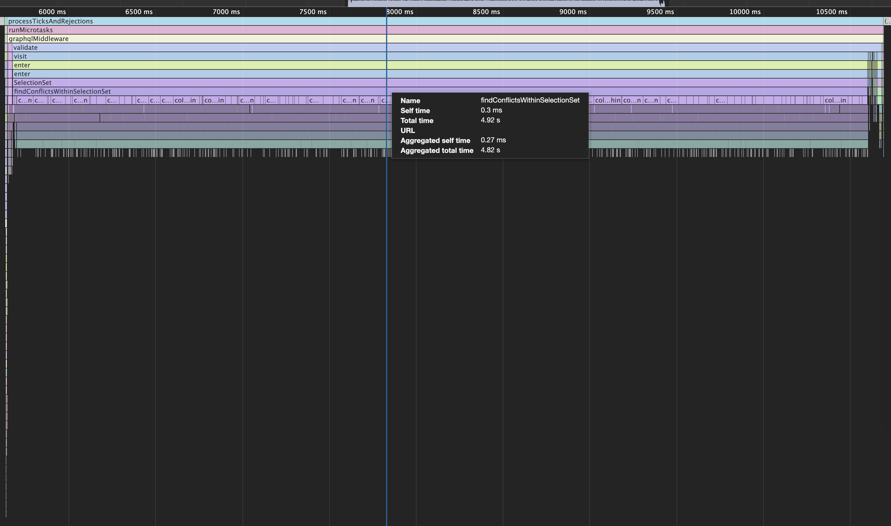

# Merge Fields Validation

Demonstration to cause the [valiation rule `OverlappingFieldsCanBeMergedRule`](https://github.com/graphql/graphql-js/blob/v15.4.0/src/validation/rules/OverlappingFieldsCanBeMergedRule.js) to consume substantial processing time.

Send [`malicious.graphql`](malicious.graphql) query. This requests the same field 5000 times but could be even larger.

The Chrome CPU profile [`example.cpuprofile`](example.cpuprofile) shows:


## Setup

### Install Node

Uses [`nvm`](https://github.com/nvm-sh/nvm) but specific version should not matter.

```
nvm install
```

### Install Dependencies

```
npm install
```

## Run Server

```
npm run start
```

## Debug

```
npm run debug
```
